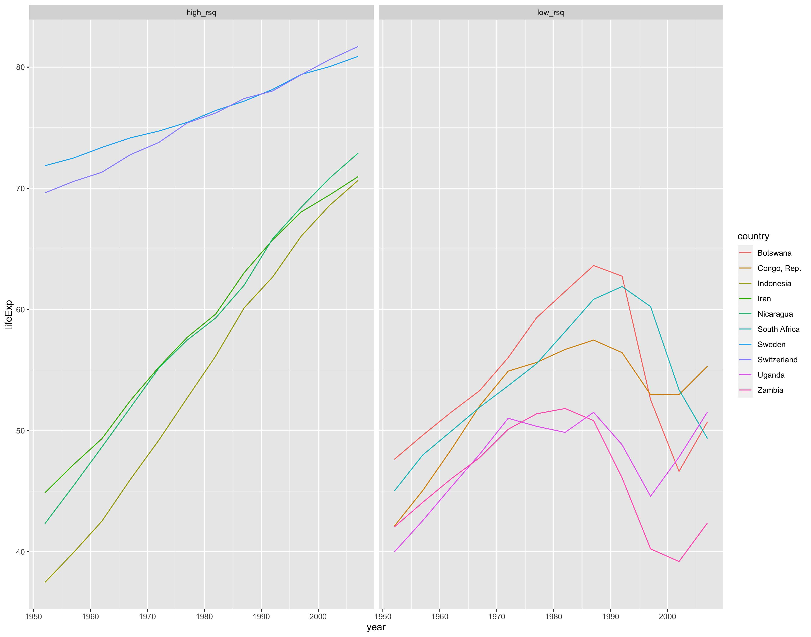
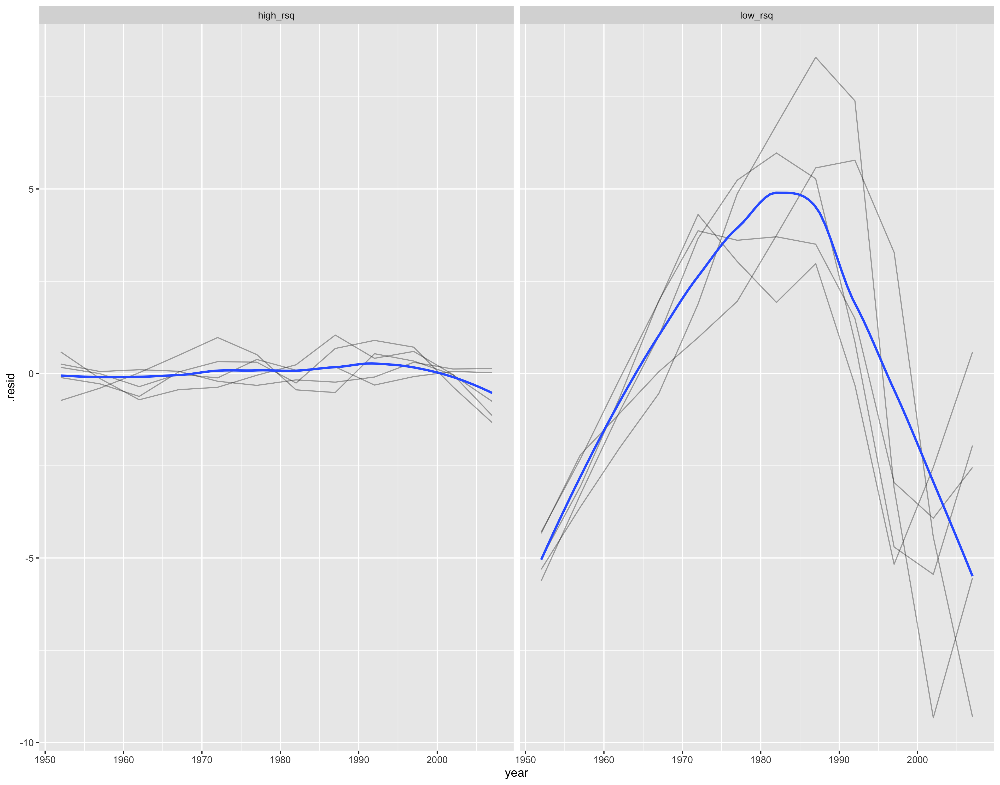

Lab 07
================

-   [Fit a linear model](#fit-a-linear-model)
-   [Fit many linear models](#fit-many-linear-models)
-   [Explore the models](#explore-the-models)
    -   [Find poorly fitting models](#find-poorly-fitting-models)
    -   [Exploring residuals](#exploring-residuals)
-   [I want to do more!](#i-want-to-do-more)

### Fit a linear model

Using the `gapminder` dataset, fit a linear model (`lm`) in which you
predict `lifeExp` from `year`.

Once you’ve fit your model, explore the various tidiers from the `broom`
package. You should be able to explain how `tidy()`, `glance()`, and
`augment()` differ from one another in the types of things they tell you
about your model.

### Fit many linear models

Using the approach I described in the lecture, fit a linear model
predicting `lifeExp` from `year` for each country in the `gapminder`
dataset.

Tidy the model outputs using functions from `broom`. Use your `dplyr`
skills to sort through the parameter estimates. `filter()` and
`arrange()` will be helpful here. You should be able to do things like
find countries where there is a non-significant relationship between
`year` and `lifeExp`.

Can you create a useful plot of the parameter estimates? This might be
challenging if you try and do it for every country so maybe select a
subset and then visualize using `ggplot`.

### Explore the models

#### Find poorly fitting models

Identify poorly fitting models by looking at the various fit statistics
you can extract with the `broom` package.

For example, here are the fit statistic for the first 10 countries when
you fit a linear model predicting `lifeExp` from `year`. Can you produce
something similar and then use your `dplyr` skills to isolate the poorly
fitting models (e.g., a low R-squared).

| country     | r.squared | adj.r.squared |     sigma |  statistic | p.value |  df |     logLik |       AIC |       BIC |   deviance | df.residual | nobs |
|:------------|----------:|--------------:|----------:|-----------:|--------:|----:|-----------:|----------:|----------:|-----------:|------------:|-----:|
| Afghanistan | 0.9477123 |     0.9424835 | 1.2227880 |  181.24941 | 1.0e-07 |   1 | -18.346935 | 42.693870 | 44.148590 | 14.9521045 |          10 |   12 |
| Albania     | 0.9105778 |     0.9016355 | 1.9830615 |  101.82901 | 1.5e-06 |   1 | -24.149036 | 54.298071 | 55.752791 | 39.3253302 |          10 |   12 |
| Algeria     | 0.9851172 |     0.9836289 | 1.3230064 |  661.91709 | 0.0e+00 |   1 | -19.292214 | 44.584427 | 46.039147 | 17.5034589 |          10 |   12 |
| Angola      | 0.8878146 |     0.8765961 | 1.4070091 |   79.13818 | 4.6e-06 |   1 | -20.030928 | 46.061857 | 47.516577 | 19.7967471 |          10 |   12 |
| Argentina   | 0.9955681 |     0.9951249 | 0.2923072 | 2246.36635 | 0.0e+00 |   1 |  -1.173933 |  8.347866 |  9.802586 |  0.8544349 |          10 |   12 |
| Australia   | 0.9796477 |     0.9776125 | 0.6206086 |  481.34586 | 0.0e+00 |   1 | -10.208677 | 26.417353 | 27.872073 |  3.8515501 |          10 |   12 |
| Austria     | 0.9921340 |     0.9913474 | 0.4074094 | 1261.29629 | 0.0e+00 |   1 |  -5.158092 | 16.316184 | 17.770904 |  1.6598240 |          10 |   12 |
| Bahrain     | 0.9667398 |     0.9634138 | 1.6395865 |  290.65974 | 0.0e+00 |   1 | -21.866662 | 49.733325 | 51.188044 | 26.8824402 |          10 |   12 |
| Bangladesh  | 0.9893609 |     0.9882970 | 0.9766908 |  929.92637 | 0.0e+00 |   1 | -15.650312 | 37.300623 | 38.755343 |  9.5392498 |          10 |   12 |
| Belgium     | 0.9945406 |     0.9939946 | 0.2929025 | 1821.68840 | 0.0e+00 |   1 |  -1.198346 |  8.396693 |  9.851413 |  0.8579187 |          10 |   12 |

Once you’ve found a few poorly fitting models, visualize the data
associated with those countries so that you can see why a linear model
might not be appropriate.

Here is an idea of how you might do that. I’m using a line plot to show
the differences in the data from countries with high vs low R-squared.
Can you make something similar?

#### Exploring residuals

Compare the residuals (extracted via `augment()`) for models with a high
R-squared vs a low R-squared. What do you find? Is there a plot you can
create to show the differences?

In the plot below, I visualize the residuals from 5 countries (the same
countries from the plot above) where the R-squared is high (vs. low).
Look at how the residuals balloon in the models that struggle to account
for the underlying data. Can you make something similar?

### I want to do more!

Find other creative and helpful ways to explore and visualize the 142
models you fit.

Start working on [hw04](hw04.md).
