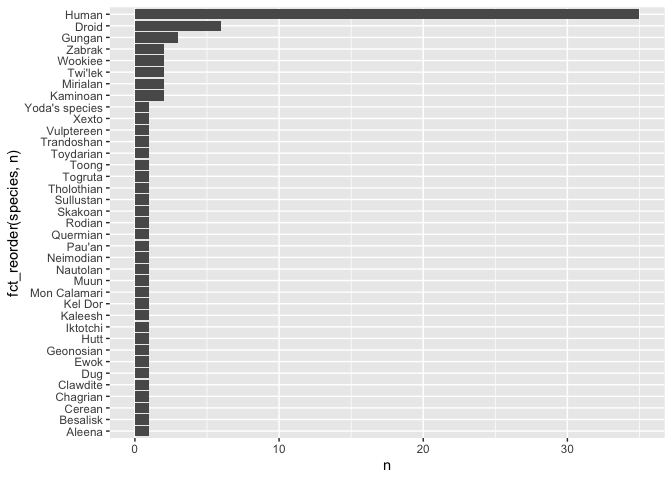
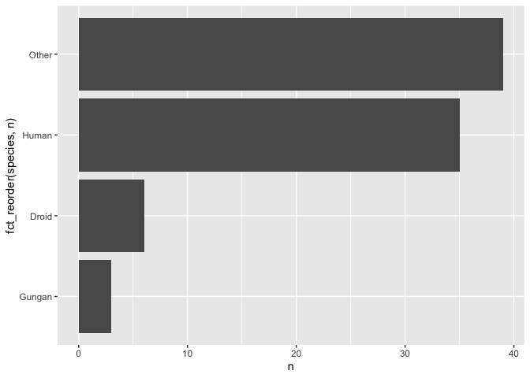

Lab 09
================

-   [Overview](#overview)
-   [`stringr`](#stringr)
    -   [String splitting by delimiter](#string-splitting-by-delimiter)
    -   [Collapse a vector](#collapse-a-vector)
    -   [Create a character vector by catenating multiple
        vectors](#catenate-vectors)
-   [`forcats`](#forcats)
    -   [`fct_lump()`](#fct_lump)
-   [I want to do more!](#i-want-to-do-more)

## Overview

This lab will show you a few functions from `stringr` and `forcats` that
we didn’t have time to cover in the lecture.

## `stringr`

### String splitting by delimiter

You can use `str_split()` to split strings by a delimiter.

Here we split on a single space `" "`.

``` r
str_split(fruit, pattern = " ") %>% 
  head(5)
```

    ## [[1]]
    ## [1] "apple"
    ## 
    ## [[2]]
    ## [1] "apricot"
    ## 
    ## [[3]]
    ## [1] "avocado"
    ## 
    ## [[4]]
    ## [1] "banana"
    ## 
    ## [[5]]
    ## [1] "bell"   "pepper"

We get a *list* back. This can be a bit annoying to work with, but it
must be so! `str_split()` must return list because who knows how many
pieces there will be? Thus, you need something that can house vectors of
different lengths.

Take a close look a the list and make sure you understand what
`str_split()` is doing.

If you are willing to commit to the number of pieces, you can use
`str_split_fixed()` and get a character matrix.

``` r
str_split_fixed(fruit, pattern = " ", n = 2) %>% 
  head(5)
```

    ##      [,1]      [,2]    
    ## [1,] "apple"   ""      
    ## [2,] "apricot" ""      
    ## [3,] "avocado" ""      
    ## [4,] "banana"  ""      
    ## [5,] "bell"    "pepper"

Check out the `class()` of the object returned by `str_split_fixed()`.
What do you learn? Take a look at help pages for `matrix` and `array` to
learn more about the returned objects.

If the to-be-split variable lives in a data frame, `tidyr::separate()`
will split it into 2 or more variables.

``` r
my_fruit_df <- tibble(fruit)
my_fruit_df %>% 
  separate(fruit, into = c("pre", "post"), sep = " ") %>% 
  print(n = 10)
```

    ## Warning: Expected 2 pieces. Missing pieces filled with `NA` in 69 rows [1, 2, 3,
    ## 4, 6, 7, 8, 10, 11, 12, 14, 15, 16, 18, 19, 20, 21, 22, 23, 24, ...].

    ## # A tibble: 80 x 2
    ##    pre          post  
    ##    <chr>        <chr> 
    ##  1 apple        <NA>  
    ##  2 apricot      <NA>  
    ##  3 avocado      <NA>  
    ##  4 banana       <NA>  
    ##  5 bell         pepper
    ##  6 bilberry     <NA>  
    ##  7 blackberry   <NA>  
    ##  8 blackcurrant <NA>  
    ##  9 blood        orange
    ## 10 blueberry    <NA>  
    ## # … with 70 more rows

Take a close look at the returned data frame and make sure you
understand what `separate()` is doing.

### Collapse a vector

You can collapse a character vector of length `n > 1` to a single string
with `str_c()`.

Give it shot by running the code below:

``` r
head(fruit) %>% 
  str_c(collapse = ", ")
```

    ## [1] "apple, apricot, avocado, banana, bell pepper, bilberry"

### Create a character vector by catenating multiple vectors

If you have two or more character vectors of the same length, you can
glue them together element-wise, to get a new vector of that length.
Here are some … awful smoothie flavors?

``` r
str_c(fruit[1:4], fruit[5:8], sep = " & ")
```

    ## [1] "apple & bell pepper"   "apricot & bilberry"    "avocado & blackberry" 
    ## [4] "banana & blackcurrant"

Element-wise catenation can be combined with collapsing.

``` r
str_c(fruit[1:4], fruit[5:8], sep = " & ", collapse = ", ")
```

    ## [1] "apple & bell pepper, apricot & bilberry, avocado & blackberry, banana & blackcurrant"

If the to-be-combined vectors are variables in a data frame, you can use
`tidyr::unite()` to make a single new variable from them.

``` r
fruit_df <- tibble(
  fruit1 = fruit[1:4],
  fruit2 = fruit[5:8]
)
fruit_df %>% 
  unite("flavor_combo", fruit1, fruit2, sep = " & ")
```

<div class="kable-table">

| flavor\_combo         |
|:----------------------|
| apple & bell pepper   |
| apricot & bilberry    |
| avocado & blackberry  |
| banana & blackcurrant |

</div>

## `forcats`

### `fct_lump()`

`fct_lump()` lets you lump together all the small groups in a factor to
make a plot or table simpler.

To demonstrate `fct_lump()`, first take a look at the plot below. Note
my use of `fct_reorder()` within `ggplot()`. Typically, we’ve used
`fct_*` functions in combination with `mutate()`. Here I show that you
can use `fct_*` functions in a `ggplot()` call.

Examining this plot, you’ll notice that several species occur quite
infrequently (e.g., Ewok).

``` r
starwars %>%
  count(species) %>%
  filter(!is.na(species)) %>% 
  ggplot(aes(y = n, x = fct_reorder(species, n))) +
  geom_col() + 
  coord_flip()
```

<!-- -->

`fct_lump()` lets you lump together all the small groups into a single
“Other” factor. You can see it in action here.

``` r
starwars %>%   
filter(!is.na(species)) %>%
  count(species = fct_lump(f = species, n = 3))
```

<div class="kable-table">

| species |   n |
|:--------|----:|
| Droid   |   6 |
| Gungan  |   3 |
| Human   |  35 |
| Other   |  39 |

</div>

Here I use `fct_lump()` to remake the plot above. Notice how
`fct_lump()` has simplified our graph.

``` r
starwars %>%   
filter(!is.na(species)) %>%
  count(species = fct_lump(f = species, n = 3)) %>% 
  ggplot(aes(y = n, x = fct_reorder(species, n))) +
  geom_col() + 
  coord_flip()
```

<!-- -->

Try adjusting the `n` argument in the `fct_lump()` function.

Use `fct_level()` to move around the Other category on your plot.

## I want to do more!

-   Work through the
    [stringr](https://cran.r-project.org/web/packages/stringr/vignettes/stringr.html)
    and [forcats](https://forcats.tidyverse.org/articles/forcats.html)
    vignettes.
-   Learn more about regular expressions by completing
    [this](https://regexone.com/) tutorial.
-   Start [homework 5](hw04.md).
